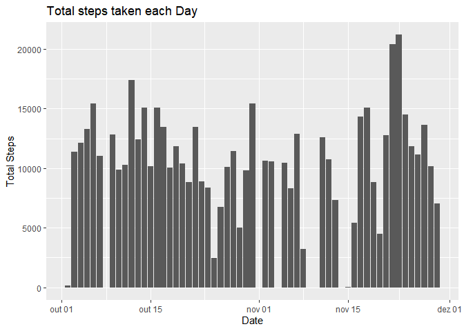
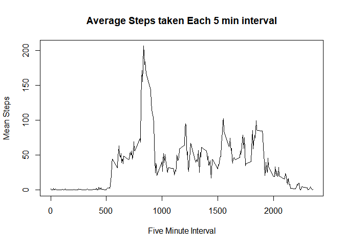
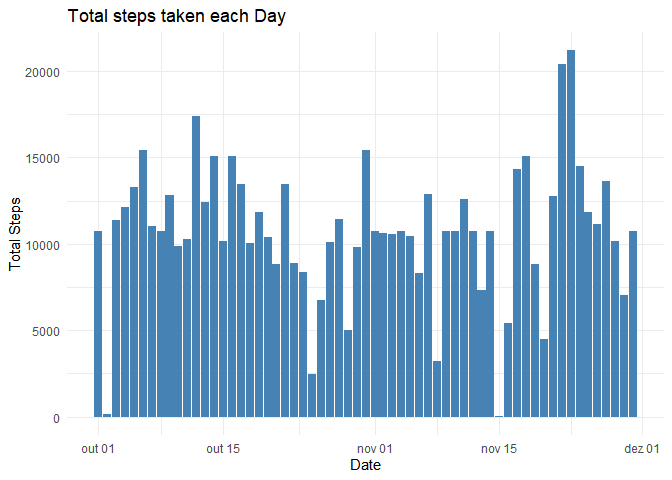
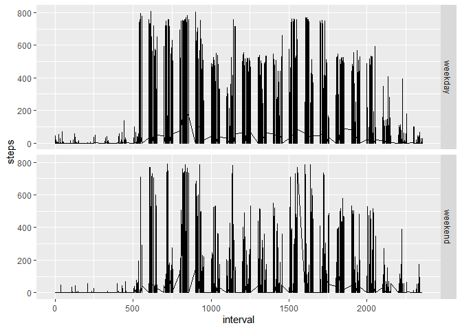

*Requires dplyr, pander and ggplot2 packages*

```r
require(dplyr)
require(ggplot2)
require(pander)
```


## Loading and preprocessing the data
1. Show any code that is needed to Load the data (i.e. read.csv())


```r
activity <- read.csv(file = "activity.csv")
```

2. Process/transform the data (if necessary) into a format suitable for your analysis


```r
activity$date <- as.Date.character(x = activity$date, format = "%Y-%m-%d")
```


## What is mean total number of steps taken per day?
For this part of the assignment, you can ignore the missing values in the dataset.


```r
## saves Data frame with NA Values for later filling
activityNA <- subset(x = activity, is.na(activity$steps))

activity <- activity[complete.cases(activity),]

byDay <- activity %>%
        group_by(date) %>%
        summarise(total.steps = sum(steps),
                  total.mean = mean(steps, na.rm = T),
                  total.median = median(steps[steps>0], na.rm = T))
```


1. Make a histogram of the total number of steps taken each day


```r
## using ggplot2
qplot(data = byDay, x = date, y = total.steps, geom = "col", 
      xlab = "Date", ylab = "Total Steps", main = "Total steps taken each Day")
```

<!-- -->


2. Calculate and report the mean and median total number of steps taken per day
  
  
  *has been calculated with the dplyr function*

```r
pandoc.table(byDay[,c(1,3,4)])
```


----------------------------------------
    date      total.mean   total.median 
------------ ------------ --------------
 2012-10-02     0.4375          63      

 2012-10-03     39.42           61      

 2012-10-04     42.07          56.5     

 2012-10-05     46.16           66      

 2012-10-06     53.54           67      

 2012-10-07     38.25          52.5     

 2012-10-09     44.48           48      

 2012-10-10     34.38          56.5     

 2012-10-11     35.78           35      

 2012-10-12     60.35           46      

 2012-10-13     43.15          45.5     

 2012-10-14     52.42          60.5     

 2012-10-15      35.2           54      

 2012-10-16     52.38           64      

 2012-10-17     46.71          61.5     

 2012-10-18     34.92          52.5     

 2012-10-19     41.07           74      

 2012-10-20     36.09           49      

 2012-10-21     30.63           48      

 2012-10-22     46.74           52      

 2012-10-23     30.97           56      

 2012-10-24     29.01          51.5     

 2012-10-25     8.653           35      

 2012-10-26     23.53          36.5     

 2012-10-27     35.14           72      

 2012-10-28     39.78           61      

 2012-10-29     17.42          54.5     

 2012-10-30     34.09           40      

 2012-10-31     53.52          83.5     

 2012-11-02     36.81          55.5     

 2012-11-03      36.7           59      

 2012-11-05     36.25           66      

 2012-11-06     28.94           52      

 2012-11-07     44.73           58      

 2012-11-08     11.18          42.5     

 2012-11-11     43.78           55      

 2012-11-12     37.38           42      

 2012-11-13     25.47           57      

 2012-11-15     0.1424         20.5     

 2012-11-16     18.89           43      

 2012-11-17     49.79          65.5     

 2012-11-18     52.47           80      

 2012-11-19      30.7           34      

 2012-11-20     15.53           58      

 2012-11-21      44.4           55      

 2012-11-22     70.93           65      

 2012-11-23     73.59          113      

 2012-11-24     50.27          65.5     

 2012-11-25     41.09           84      

 2012-11-26     38.76           53      

 2012-11-27     47.38           57      

 2012-11-28     35.36           70      

 2012-11-29     24.47          44.5     
----------------------------------------


## What is the average daily activity pattern?

1. Make a time series plot (i.e. type = "l") of the 5-minute interval (x-axis) and the average number of steps taken, averaged across all days (y-axis)


```r
byTime <- activity %>%
        group_by(interval) %>%
        summarise(total.steps = sum(steps),
                  mean.steps = mean(steps, na.rm = T))

## using R base plotting 
with(data = byTime, plot(x = interval, y = mean.steps, type = 'l', 
                         main = "Average Steps taken Each 5 min interval", 
                         xlab = "Five Minute Interval", 
                         ylab = "Mean Steps"))
```

<!-- -->

2. Which 5-minute interval, on average across all the days in the dataset, contains the maximum number of steps?


```r
max.steps <- subset(x = byTime, mean.steps == max(byTime$mean.steps))
```

The **835**  five minute interval contains te maximum number of steps with **10927** steps and mean **206.1698113**.

## Imputing missing values
1. Calculate and report the total number of missing values in the dataset  
*caculated by the activityNA <- subset(x = activity, is.na(activity$steps)) code*

**Total rows with NA values is: 2304**

2. Devise a strategy for filling in all of the missing values in the dataset.


```r
## fill NA values with the Average Steps taken Each 5 min interval
## merging the NA data with the by interval data mean steps.

filledActivity <- merge(x = byTime[c(3, 1)], y = activityNA[c(2,3)])
names(filledActivity) <- c("interval", "steps", "date")
```

3. Create a new dataset that is equal to the original dataset but with the missing data filled in

```r
## binds the Filled Data Set With the original Data
newActivity <- bind_rows(activity, filledActivity)
newActivity <- arrange(.data = newActivity, newActivity$date)
```

4. Make a histogram of the total number of steps taken each day and Calculate and report the mean and median total number of steps taken per day. 


```r
newByDay <- newActivity %>%
        group_by(date) %>%
        summarise(total.steps = sum(steps),
                  total.mean = mean(steps, na.rm = T),
                  total.median = median(steps[steps>0], na.rm = T))

## uses ggplot2
ggplot(data = newByDay, aes(x = date, y = total.steps))+
        geom_bar(stat="identity", fill="steelblue")+
        theme_minimal()+
        labs(title = "Total steps taken each Day")+
        labs(x = "Date", y = "Total Steps" )
```

<!-- -->

```r
pandoc.table(newByDay[,c(1,3,4)])
```


----------------------------------------
    date      total.mean   total.median 
------------ ------------ --------------
 2012-10-01     37.38         37.45     

 2012-10-02     0.4375          63      

 2012-10-03     39.42           61      

 2012-10-04     42.07          56.5     

 2012-10-05     46.16           66      

 2012-10-06     53.54           67      

 2012-10-07     38.25          52.5     

 2012-10-08     37.38         37.45     

 2012-10-09     44.48           48      

 2012-10-10     34.38          56.5     

 2012-10-11     35.78           35      

 2012-10-12     60.35           46      

 2012-10-13     43.15          45.5     

 2012-10-14     52.42          60.5     

 2012-10-15      35.2           54      

 2012-10-16     52.38           64      

 2012-10-17     46.71          61.5     

 2012-10-18     34.92          52.5     

 2012-10-19     41.07           74      

 2012-10-20     36.09           49      

 2012-10-21     30.63           48      

 2012-10-22     46.74           52      

 2012-10-23     30.97           56      

 2012-10-24     29.01          51.5     

 2012-10-25     8.653           35      

 2012-10-26     23.53          36.5     

 2012-10-27     35.14           72      

 2012-10-28     39.78           61      

 2012-10-29     17.42          54.5     

 2012-10-30     34.09           40      

 2012-10-31     53.52          83.5     

 2012-11-01     37.38         37.45     

 2012-11-02     36.81          55.5     

 2012-11-03      36.7           59      

 2012-11-04     37.38         37.45     

 2012-11-05     36.25           66      

 2012-11-06     28.94           52      

 2012-11-07     44.73           58      

 2012-11-08     11.18          42.5     

 2012-11-09     37.38         37.45     

 2012-11-10     37.38         37.45     

 2012-11-11     43.78           55      

 2012-11-12     37.38           42      

 2012-11-13     25.47           57      

 2012-11-14     37.38         37.45     

 2012-11-15     0.1424         20.5     

 2012-11-16     18.89           43      

 2012-11-17     49.79          65.5     

 2012-11-18     52.47           80      

 2012-11-19      30.7           34      

 2012-11-20     15.53           58      

 2012-11-21      44.4           55      

 2012-11-22     70.93           65      

 2012-11-23     73.59          113      

 2012-11-24     50.27          65.5     

 2012-11-25     41.09           84      

 2012-11-26     38.76           53      

 2012-11-27     47.38           57      

 2012-11-28     35.36           70      

 2012-11-29     24.47          44.5     

 2012-11-30     37.38         37.45     
----------------------------------------
  
Do these values differ from the estimates from the first part of the assignment? **YES**   

What is the impact of imputing missing data on the estimates of the total daily number of steps? Main diference is that it adds data to `2012-10-01, 2012-10-08, 2012-11-01, 2012-11-04, 2012-11-09, 2012-11-10, 2012-11-14, 2012-11-30` days

## Are there differences in activity patterns between weekdays and weekends?
For this part the weekdays() function may be of some help here. Use the dataset with the filled-in missing values for this part.

1. Create a new factor variable in the dataset with two levels -- "weekday" and "weekend" indicating whether a given date is a weekday or weekend day.


```r
## adds weekday collumn
newActivity$weekday <- weekdays(abbreviate = T, newByDay$date)
## adds factor
newActivity$period <- factor(
        ifelse(newActivity$weekday %in% c("sáb", "dom"), "weekend", "weekday"))
```

2. Make a panel plot containing a time series plot (i.e. type = "l") of the 5-minute interval (x-axis) and the average number of steps taken, averaged across all weekday days or weekend days (y-axis).


```r
qplot(x = interval, y = steps, data = newActivity, facets = period~., 
      geom = "line")
```

<!-- -->

